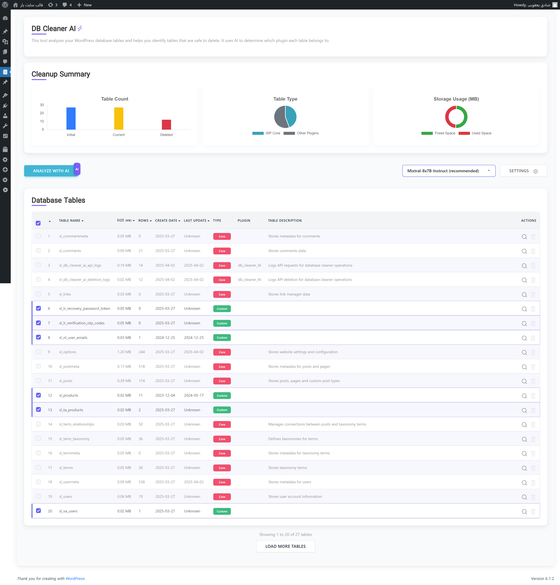

# DB Cleaner AI - Showcase

**DB Cleaner AI** is a WordPress plugin designed to help users analyze, identify, and clean up unused database tables left by uninstalled plugins. This showcase repository provides an overview, documentation, and resources related to the plugin.

### 🔗 Live Preview (GitHub Pages)
The showcase site is available at:  
👉 **[https://sadeq-yaqobi.github.io/db-cleaner-ai-showcase](https://sadeq-yaqobi.github.io/db-cleaner-ai-showcase)**  

---

## 🔥 Features
- 🛠 **Identify Unused Tables**: Detect orphaned tables that remain after removing plugins.
- 📊 **Table Insights**: Display table size, record count, last modification date, and more.
- 🚀 **AI-Powered Analysis**: Uses an AI-driven API to determine the origin of database tables.
- ⚡ **Safe Deletion Process**: Provides warnings and recommendations before table deletion.
- 🌓 **Modern UI with UIkit**: A clean and intuitive interface for managing your database.
- 📝 **Logging System**: Keeps track of deleted tables for transparency.

## 📷 Screenshots
| Before Analysis | After Analysis |
|----------------|---------------|
|  |  |

## 📖 Documentation
Find the full documentation [here](document.html).

## 🎥 Demo Video (Coming Soon)
We are working on a video demonstration to show how the plugin works in action.

## 🛠 Installation
1. Download the latest **DB Cleaner AI** plugin `.zip` file (coming soon).
2. Upload the plugin to your WordPress installation via **Plugins > Add New**.
3. Activate the plugin and start scanning your database.
4. Review the detected tables and decide which ones to remove.

## 🚀 Roadmap
- Add translation support.
- Improve AI analysis for better table identification.
- Implement scheduled scans.

## 💡 Contribute
If you have suggestions or improvements, feel free to create an issue or pull request.

## 📩 Contact & Support
For any inquiries, reach out via **GitHub Issues** or contact us at **[Your Email or Website]**.

---

⚠ **Disclaimer**: Always create a backup of your database before deleting tables!
